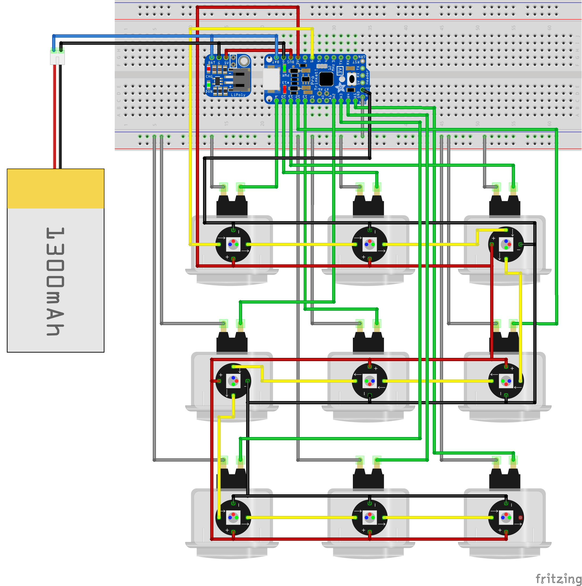

# Tic-Tac-Toe Machine

A hardware-based tic-tac-toe game

## Electronics
Game uses the following parts:
* [Adafruit Pro Trinket 3.3V](https://www.adafruit.com/product/2010)
* [Adafruit Pro Trinket LiIon/LiPoly Backpack Add-On](https://www.adafruit.com/products/2124)
* [NeoPixel Mini PCB](https://www.adafruit.com/products/1612) (9x)
* [Arcade Button - 30mm Translucent Clear](https://www.adafruit.com/products/471) (9x)
* [Lithium Ion Cylindrical Battery - 3.7v 2200mAh](https://www.adafruit.com/products/1781)

and also some arcade wires and connectors:
* [Premium Female/Male 'Extension' Jumper Wires - 40 x 6" (150mm)](https://www.adafruit.com/products/826)
* [Arcade/Button Quick-Connect Wire Pair](https://www.adafruit.com/products/1152) (9x)
* [JST Connectors](https://www.digikey.com/product-detail/en/jst-sales-america-inc/B2B-XH-A(LF)(SN)/455-2247-ND/1651045) (9x)

### Schematic

## Eclosure
Enclosure consists of a box and a lid and can be 3D-printed without support material:
http://www.thingiverse.com/thing:1687483
